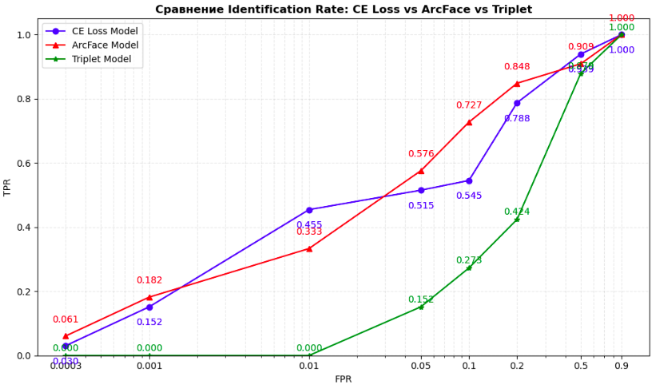

# Face Recognition Project

## Итоговый проект по курсу Deep Learning (семестр 1, осень 2025) от Школы глубокого обучения ФПМИ МФТИ на stepik.org

Проект представляет собой реализацию **пайплайна распознавания лиц**, состоящего из трёх этапов: детекция → выравнивание → распознавание. Реализован в рамках учебного проекта по глубокому обучению.

## Содержание

- [Цель проекта](#цель-проекта)
- [Архитектура пайплайна](#архитектура-пайплайна)
- [Результаты](#результаты)
- [Структура проекта](#структура-проекта)
- [Установка и запуск](#установка-и-запуск)
- [Использование](#использование)
- [Данные и веса моделей](#данные-и-веса-моделей)

## Цель проекта

Создание модульного пайплайна распознавания лиц, способного:
- Обнаруживать несколько лиц на одном изображении
- Выравнивать лица по 5 ключевым точкам для повышения качества распознавания
- Извлекать эмбеддинги лиц для сравнения и идентификации
- Сравнивать лица между изображениями с количественной оценкой сходства

## Архитектура пайплайна

```
Исходное изображение
        ↓
┌──────────────────────┐
│ 1. Детекция лиц      │ ← MTCNN (facenet-pytorch)
│    → bbox + кропы    │    Выход: лица 112×112
└──────────────────────┘
        ↓
┌──────────────────────┐
│ 2. Выравнивание      │ ← Stacked Hourglass
│    → 5 лендмарков    │    Выход: выровненные лица 112×112
└──────────────────────┘
        ↓
┌──────────────────────┐
│ 3. Распознавание     │ ← ResNet18 + ArcFace
│    → эмбеддинги      │    Выход: 1024 векторы
└──────────────────────┘
        ↓
Косинусное сходство → Решение "один человек / разные люди"
```

## Результаты

| Этап | Модель | Метрика | Результат |
| :--- | :--- | :--- | :--- |
| **Выравнивание** | StackedHourglass (nstack=2, inp_dim=128) | NME | 5.60% (эпоха 64) |
| **Распознавание** | ResNet18 + CE Loss | Test Accuracy | 0.7455 |
| **Распознавание** | ResNet18 + ArcFace (embedding_size=1024) | Test Accuracy | 0.7879 |
| **Распознавание** | ResNet18 + ArcFace | Val Accuracy | 0.7848 |
| **Распознавание** | Triplet Loss | Test Accuracy | 0.7823 |
| **Идентификация** | ArcFace | TPR@FPR=0.01 | 0.3333 |
| **Идентификация** | CE Loss | TPR@FPR=0.01 | 0.4545 |

**Ключевые достижения:**
- Точность распознавания **78.79%** на тестовом наборе из 440 персон
- Средняя ошибка локализации лендмарков **5.60%** (NME)
- Поддержка сравнения лиц с градацией сходства: "один человек" / "очень похожи" / "разные люди"
- Работа с групповыми фотографиями (детекция нескольких лиц одновременно)

## Структура проекта

```
face-recognition-pipeline/
├── src/
│   ├── models/          # Классы моделей (Hourglass, ArcFace, Triplet)
│   └── utils.py         # Выравнивание лиц и стандартные лендмарки
├── pipeline.py          # Основной модуль пайплайна
├── checkpoints/         # Веса моделей (ссылка на облако в README.md)
├── data_CelebA_mini/    # Уменьшенный датасет (ссылка на облако в README.md)
│   ├── data/            # Исходные изображения (11 000 шт)
│   ├── data_aligned/    # Выровненные изображения
│   └── metadata_fr/     # Метаданные для распознавания
├── output/              # Результаты работы пайплайна
└── README.md            # Документация
```

## Установка и запуск

### Требования
- Ubuntu 24.04
- Python 3.11+
- NVIDIA GPU с поддержкой CUDA 12.1
- Conda для управления окружением

### Настройка окружения
```bash
# Создание окружения
conda create -n face_recognition python=3.11
conda activate face_recognition

# Установка базовых зависимостей
conda install pytorch torchvision pytorch-cuda=12.1 -c pytorch -c nvidia
conda install opencv matplotlib scikit-learn pandas tqdm pillow

# Установка специфичных пакетов
pip install facenet-pytorch albumentations ipykernel
```

### Загрузка данных и весов
1. Скачайте **уменьшенный датасет** по ссылке в `data_CelebA_mini/README.md`
2. Скачайте **веса моделей** по ссылке в `checkpoints/README.md`
3. Распакуйте архивы в соответствующие директории проекта

## Использование

### Вариант 1: Запуск из терминала
```bash
# Анализ лиц на одном изображении
python pipeline.py --image image1.jpg --output output/compare_img1 --threshold 0.8

# Сравнение лиц между двумя изображениями
python pipeline.py --image image2.jpg --image2 image3.jpg --output output/compare_img2_img3 --threshold 0.8

# Режим терминала (без графического вывода)
python pipeline.py --image image1.jpg --image2 image2.jpg --output output/compare_img1_img2 --no-show
```

### Вариант 2: Использование в ноутбуке
```python
from pipeline import FR_Pipeline

# Инициализация пайплайна
pipeline = FR_Pipeline(
    hourglass_state_path='checkpoints/StackedHourglass_best_model_nme_20260123_233506_epoch_64_nme_5.60.pth',
    arcface_state_path='checkpoints/arcface_model_20260126_163544_epoch_38_val_0.7848.pth',
    device='cuda'
)

# Распознавание лиц
result = pipeline.recognize('image1.jpg', output_dir='output/1')

# Сравнение лиц на одном изображении
result = pipeline.recognize('image1.jpg', output_dir='output/2')
pipeline.visualize_similarity_matrix(result, result, threshold=0.8)

# Сравнение двух изображений
result1 = pipeline.recognize('image1.jpg', output_dir='output/3')
result2 = pipeline.recognize('image2.jpg', output_dir='output/4')
pipeline.visualize_similarity_matrix(result1, result2, threshold=0.8)
```

## Данные и веса моделей

Из-за ограничений размера репозитория на GitHub:

📁 **`data_CelebA_mini/`**  
→ Полный уменьшенный датасет (11 000 изображений, 550 персон по 20 изображений) доступен по ссылке в `data_CelebA_mini/README.md`  
→ Включает: выровненные изображения, метаданные, разделение на train/val/test/query/distractors

📁 **`checkpoints/`**  
→ Веса всех обученных моделей доступны по ссылке в `checkpoints/README.md`  
→ Включает:
  - `StackedHourglass_best_model_nme_20260123_233506_epoch_64_nme_5.60.pth` — Stacked Hourglass (NME 5.60%)
  - `arcface_model_20260126_163544_epoch_38_val_0.7848.pth` — ResNet18 + ArcFace (точность 0.7879)
  - `triplet_best_epoch_20260131_2225_epoch_12_val_0.7967.pth` — Triplet Loss модель (точность 0.7823)

## Выводы


1. Собран стратифицированный мини набор данных изображений с их метаданными объемом в 11 тыс. изображений, 550 персон по 20 изображений. Выборка для каждого человека стратифицирована по 16 признакам/атрибутам. Класс датасета трансформирует "сырые" изображения: делает обрезку по bbox'у с возможным дополнительным коэффициентом, пересчитывает координаты ключевых точек лица, реализует аугментацию изображений, приводит все изображения к размеру 112х112. Модель **StackedHourglass** обучена на 80 эпохах и достигла результатов: **лучший loss 0.0003**; **лучший NME 5.60%**. Лучшие метрики достигнуты на 64 эпохе. Веса сохранены в файл **checkpoints/best_model_nme_20260123_233506_epoch_64_nme_5.60.pt** Сформирован набор данных выровненных изображений для следующих этапов проекта по распознаванию лиц.

2. Обученная базовая модель распознавания на базе **ResNet18 с CE loss** продемонстрировала точность на тесте 0.7455

3. Обученная модель распознавания на базе **ResNet18 с ArcFace Loss** показала наилучшие результаты как в точности классификации, так и в обобщающей способности на незнакомых лицах: точность на тесте 0.7879, точность на валидации 0.7924. Параметры ArcFace (m=0.57, s=40.0) и размер эмбеддингов (1024) подобраны экспериментально.

4. Обе модели ошибаются на лицах в очках, с усами, когда что-то закрывает лицо (руки, волосы), также азиатские лица хуже распознаются, наверное из-за меньшего объема в датасете. Для дальнейшего улучшения модели распознавания можно использовать более глубокие ResNet34, ResNet50 или попробовать другие архитектуры, например, EfficientNet. Также следует увеличить объем датасета, на котором учатся модели. Также хороший прирост в качестве, на мой взгляд, можно получить поставив четкую цель для системы распознавания лиц - где будет работать, что надо минимизировать ошибки первого или второго рода (у нас все-таки система классификации), от этого будет зависеть техническое задание на подготовку обучающего датасета - выбор необходимых признаков, стратифицированная выборка, выборка количества персон и количества изображений каждой персоны.

5. **Identification Rate Metric.** Результаты показывают, что ArcFace не доминирует на всем диапазоне fpr, но в среднем, чем выше требование к ошибке (т.е. чем ниже fpr), тем ArcFace работает лучше, так как модель пытается развести ембендинги разных людей подальше друг от друга. ArcFace отлично показывает себя при очень низких fpr, значит, ее можно использовать для критически важных областей, где цена ошибки в распознавании велика, например, банковские приложения, контроль доступа на территорию, и т.д. Некоторый "провал" в качестве классификации при fpr=0.01 возможно вызван малым датасетом (не хватило разнообразия в пространстве признаков и одна модель в данной области пространства эмбеддингов ведет себя лучше). Для улучшения характеристик обеих моделей или для более глубокого исследования необходимо подготовить более разнообразный датасет с бОльшим количеством изображений на каждую персону, также можно улучшить модель StackedHourglass для лучшего предсказания heatmaps, а, значит, и landmarks, ну и наконец, можно (нужно) взять более глубокую сеть для модели распознавания лиц (например, ResNet50)



6. Обученная модель на базе **ResNet18 с Triplet Loss** достигла общей **accuracy: 0.8438**. Произведена оценка модели по Identification Rate Metric, которая показывает, что несмотря на высокий accuracy модель имеет очень посредственную IR-метрику, то есть модель плохо работает на незнакомых изображениях.

7. Для детекции лиц на изображениях выбран современный детектор **MTCNN** библиотеки **facenet_pytorch**, обеспечивающий хороший баланс скорости и качества.

8. Все модели (детекции лиц, нахождения ключевых точек лица, выравнивания лица, распознавания лица с кодированием его в ембеддинг и получением косинусного сходства и расстояния) собраны вместе в третьей части проекта - пайплайне (**pipeline_oav.py**). В ноутбуке **call_pipeline_oav.ipynb** продемонстрированы возможности реализованного пайплайна.

9. **Выравнивание лиц критически важно** — предварительная нормализация геометрии лица через 5 ключевых точек повысила точность распознавания.

10. **Размер эмбеддингов влияет на качество** — для задачи распознавания лиц оптимальна размерность 1024 (против 512 в предварительной/базовой реализации).

11. **Детектор лиц требует настройки** — параметры (особенно `keep_all=True`) в MTCNN влияют на качество обработки групповых фотографий.

12. **Пайплайн готов к применению** — модульная архитектура позволяет легко заменять компоненты без переписывания всего кода.

